<p align="center">
  
</p>

<h1 align="center">ReportaCiudad</h1>

<p align="center">
  <strong>Santa Cruz, mirada por todos.</strong><br>
  App Android para que los vecinos de Santa Cruz de la Sierra reporten los problemas de su ciudad<br>
  —baches, basura, alumbrado, fugas de agua, incendios— con foto y ubicación, en menos de un minuto.
</p>

<p align="center">
  
  
  
  
  
  
</p>

<p align="center">
  <a href="#-capturas">Capturas</a> ·
  <a href="#-funcionalidades">Funcionalidades</a> ·
  <a href="#-cómo-funciona">Cómo funciona</a> ·
  <a href="#-cómo-ejecutarla">Cómo ejecutarla</a> ·
  <a href="#-hoja-de-ruta">Hoja de ruta</a>
</p>

---

## 📸 Capturas

<table>
  <tr>
    <td align="center">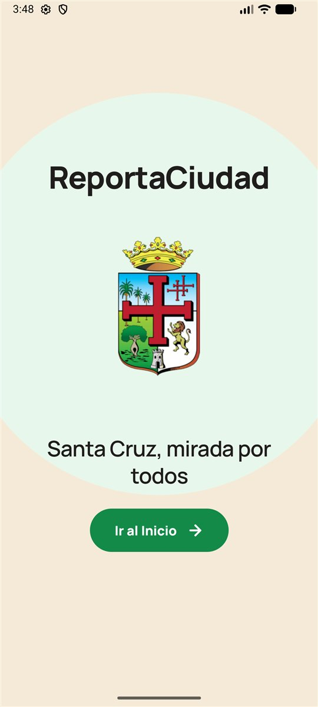<br><sub><b>Bienvenida</b></sub></td>
    <td align="center">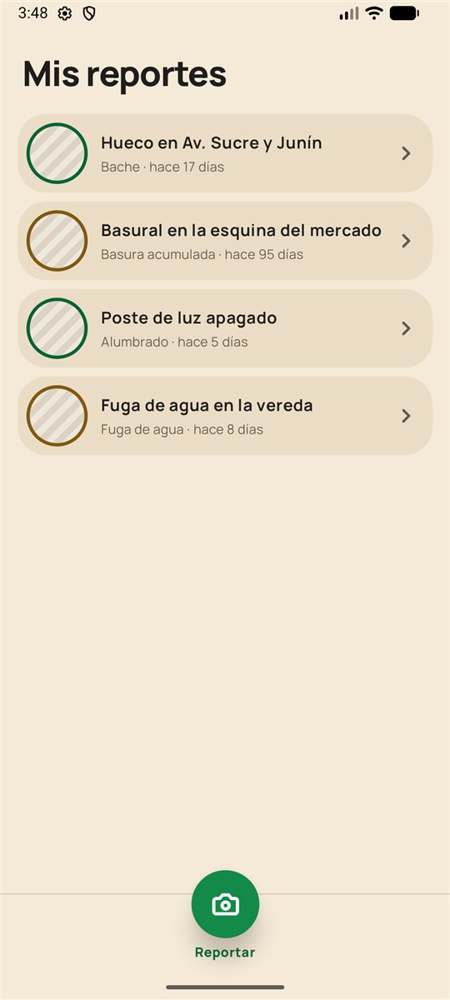<br><sub><b>Mis reportes</b></sub></td>
    <td align="center">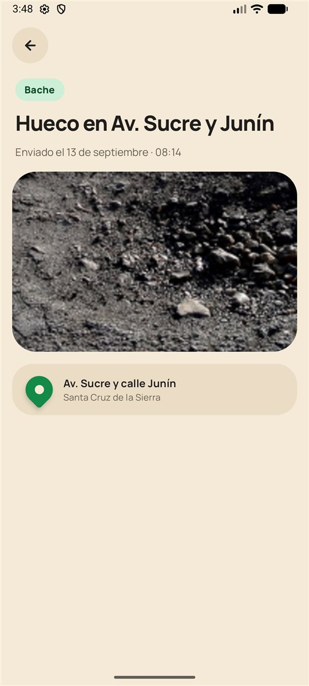<br><sub><b>Detalle del reporte</b></sub></td>
  </tr>
</table>

### Reportar un problema, en 5 pasos

<table>
  <tr>
    <td align="center">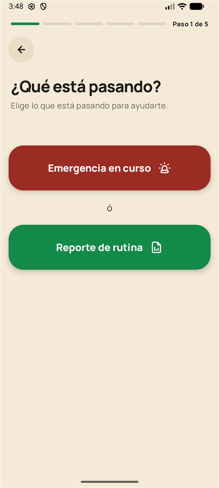<br><sub><b>1 · ¿Qué está pasando?</b></sub></td>
    <td align="center">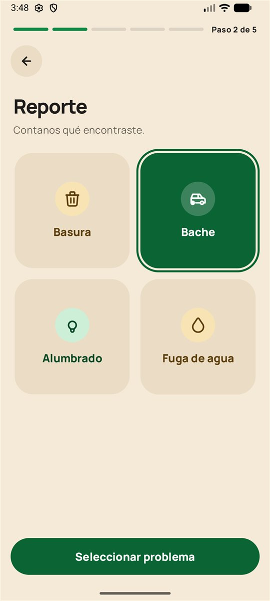<br><sub><b>2 · Tipo de problema</b></sub></td>
    <td align="center">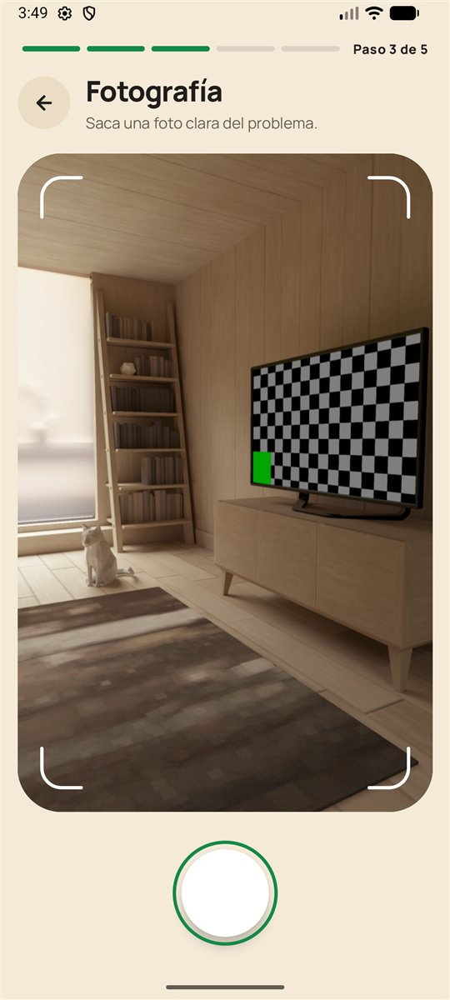<br><sub><b>3 · Fotografía</b></sub></td>
    <td align="center">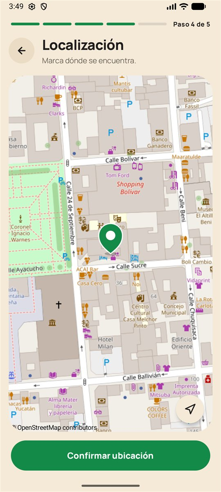<br><sub><b>4 · Localización</b></sub></td>
    <td align="center">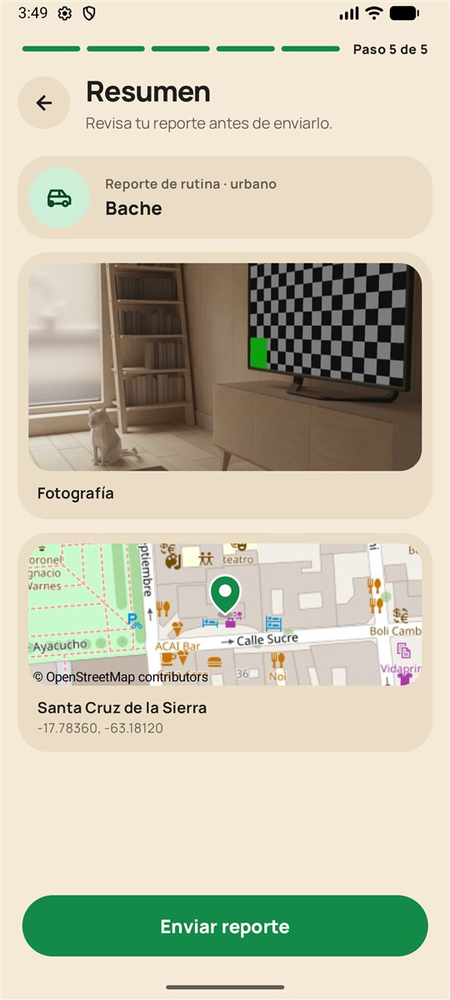<br><sub><b>5 · Resumen</b></sub></td>
  </tr>
</table>

<table>
  <tr>
    <td align="center">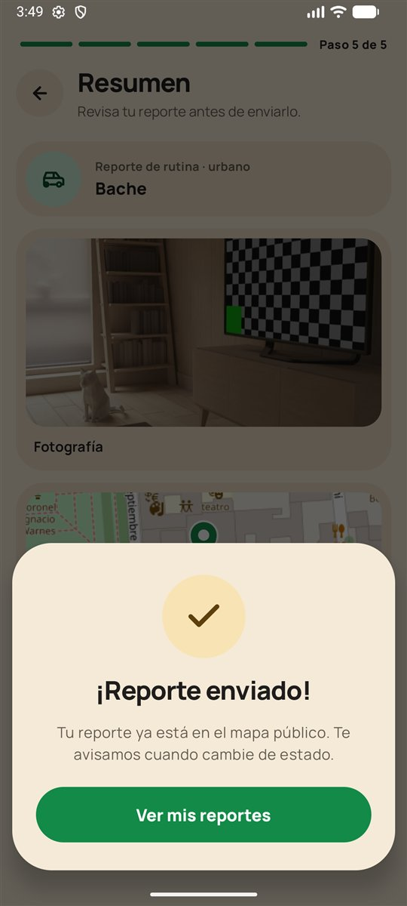<br><sub><b>¡Reporte enviado!</b></sub></td>
    <td align="center">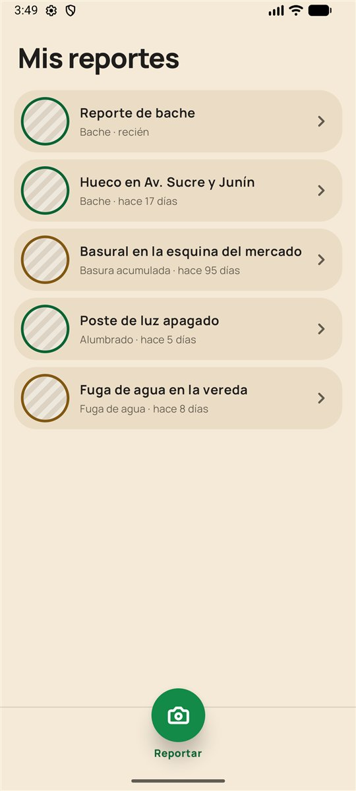<br><sub><b>El reporte aparece en la lista</b></sub></td>
  </tr>
</table>

---

## ✨ Funcionalidades

| | Pantalla | Qué hace |
|:---:|---|---|
| 🏛️ | **Bienvenida** | Presenta la app con el escudo de Santa Cruz y el lema. |
| 📋 | **Mis reportes** | Lista de reportes con categoría y antigüedad ("recién", "hace 3 h", "hace 17 días"), con un color por familia: 🟢 urbano, 🟠 ambiental. |
| 🔍 | **Detalle** | Categoría, título, fecha y hora de envío, foto y ubicación del reporte. |
| 🚨 | **Paso 1 · Tipo** | Elegir entre **emergencia en curso** o **reporte de rutina**. |
| 🗂️ | **Paso 2 · Categoría** | Emergencias: incendio o humo. Rutina: basura, bache, alumbrado o fuga de agua. |
| 📷 | **Paso 3 · Fotografía** | Cámara dentro de la app (CameraX): visor con guías, destello, *Repetir* o *Usar foto*. |
| 📍 | **Paso 4 · Localización** | Toma la ubicación **GPS** del teléfono y la muestra en un mapa de OpenStreetMap. |
| ✅ | **Paso 5 · Resumen** | Revisa categoría, foto y mapa antes de enviar; confirma con el modal **¡Reporte enviado!** |

**Detalles que cuidamos**

- 🕐 **Hora de Bolivia automática**: cada reporte guarda el momento en que se creó y lo muestra en hora boliviana (`America/La_Paz`, UTC-4), aunque el teléfono esté en otra zona horaria.
- 🔐 **Permisos bien manejados**: la cámara y la ubicación se piden al llegar a su paso, con opción de reintentar o de ir a los ajustes si el usuario los bloqueó.
- 🧹 **Sin archivos huérfanos**: las fotos que no se usan (al repetir o al salir sin confirmar) se borran del teléfono.
- 📶 **Avisos útiles**: sin conexión, sin GPS o sin permiso, la pantalla lo explica en lugar de fallar.
- ♿ **Accesibilidad**: botones de al menos 48 dp, textos para lectores de pantalla y contraste revisado.
- ☀️ **Siempre en modo claro**, con la paleta propia de la marca (sin colores dinámicos del sistema).

---

## 🧭 Cómo funciona

### Navegación

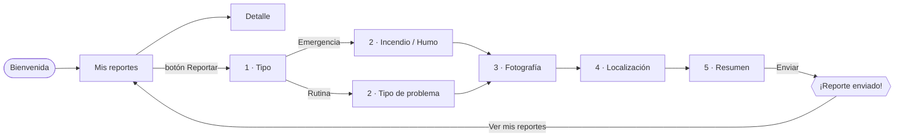

Todas las rutas viven en un único `NavHost` (`ReportaCiudadScreen.kt`). Las pantallas no navegan solas: reciben *callbacks* (`onVolver`, `onSeleccionar`, `onFotoTomada`…) y el `NavHost` decide a dónde ir.

### El borrador del reporte

Mientras el usuario avanza por los pasos, sus respuestas se juntan en un **`BorradorReporte`**, que vive en el `NavHost`:

```
Paso 2  →  borrador.copy(problema = BACHE)
Paso 3  →  borrador.copy(fotoRuta = ".../files/fotos/reporte_1790....jpg")
Paso 4  →  borrador.copy(latitud = -17.7836, longitud = -63.1812)
Paso 5  →  enviarReporte(borrador)   →   se crea el Reporte y se agrega a la lista
```

Cada pantalla solo **avisa** lo que eligió el usuario; el `NavHost` es el único que escribe en el borrador. El reporte se puede enviar cuando está completo (`estaCompleto`): con categoría, foto y ubicación.

### Datos

| Pieza | Dónde | Qué hace |
|---|---|---|
| `reportes` | `data/reportes/Reportes.kt` | Lista observable de reportes: la pantalla se actualiza sola al agregar uno. |
| `enviarReporte()` | `data/reportes/EnviarReporte.kt` | Valida el borrador, crea el reporte y lo agrega primero en la lista. |
| `crearReporte()` | `data/reportes/CrearReporte.kt` | Convierte el borrador en un `Reporte` (título, categoría, lugar, foto). |
| `buscarReporte()` | `data/reportes/BuscarReporte.kt` | Busca un reporte por `id` para el Detalle. |
| `FechaBolivia` | `data/FechaBolivia.kt` | Formatea fechas en hora boliviana y calcula la antigüedad. |
| `AlmacenFotos` | `data/AlmacenFotos.kt` | Crea y borra las fotos en la carpeta privada de la app. |
| `UbicacionActual` | `data/UbicacionActual.kt` | Obtiene la ubicación por GPS o, si no responde, por red. |

---

## 🛠️ Tecnologías

| Área | Herramienta | Versión |
|---|---|---|
| Lenguaje | Kotlin | 2.2 |
| Interfaz | Jetpack Compose + Material 3 | BOM `2026.02.01` |
| Navegación | Navigation Compose | 2.8.0 |
| Cámara | CameraX (`camera-camera2`, `camera-lifecycle`, `camera-view`) | 1.6.2 |
| Imágenes | Coil | 3.4.0 |
| Mapas | osmdroid + tiles de OpenStreetMap | 6.1.20 |
| Ubicación | `LocationManager` de Android (sin Google Play Services) | — |
| Build | Gradle Kotlin DSL + catálogo de versiones, AGP | 9.3 |
| SDK | `minSdk 24` · `targetSdk 37` · `compileSdk 37` | — |

### Permisos

| Permiso | Para qué |
|---|---|
| `CAMERA` | Sacar la foto del problema (paso 3). |
| `ACCESS_FINE_LOCATION` / `ACCESS_COARSE_LOCATION` | Guardar dónde está el problema (paso 4). |
| `INTERNET` / `ACCESS_NETWORK_STATE` | Descargar el mapa y avisar cuando no hay conexión. |

---

## 🗂️ Estructura del proyecto

```
app/src/main/java/com/example/reportaciudad/
├── MainActivity.kt                    # Punto de entrada: tema y barras del sistema
├── data/
│   ├── AlmacenFotos.kt                # Fotos en files/fotos/
│   ├── FechaBolivia.kt                # Fechas en hora de Bolivia
│   ├── UbicacionActual.kt             # GPS / red
│   ├── model/                         # Reporte, BorradorReporte, TipoProblema, TipoEmergencia
│   └── reportes/                      # reportes, enviarReporte, crearReporte, buscarReporte, ejemplos
└── ui/
    ├── screens/
    │   ├── ReportaCiudadScreen.kt     # NavHost con todas las rutas
    │   ├── bienvenida/
    │   ├── inicio/                    # Mis reportes
    │   ├── detalle/
    │   └── reportar/
    │       ├── componentes/           # PasoReporte, BarraProgreso, tarjetas y botones comunes
    │       ├── tipo/                  # Paso 1
    │       ├── emergencia/            # Paso 2 (emergencia)
    │       ├── problema/              # Paso 2 (rutina)
    │       ├── fotografia/            # Paso 3 + VisorCamara (CameraX)
    │       ├── localizacion/          # Paso 4 + mapa
    │       └── resumen/               # Paso 5 + modal de enviado
    └── theme/                         # Colores, tipografía y tema
```

---

## 🎨 Sistema de diseño

Una paleta cálida, de tonos tierra, pensada para la ciudad.

| | Color | Hex | Uso |
|:---:|---|---|---|
|  | **Urbano** | `#138A48` | Color principal, botones, familia urbana |
|  | **Ambiental** | `#B8801F` | Familia ambiental |
|  | **Emergencia** | `#9B2C24` | Emergencias en curso |
|  | **Fondo** | `#F5EAD8` | Fondo de las pantallas |
|  | **Superficie** | `#EBDDC5` | Tarjetas y botones secundarios |
|  | **Texto** | `#201E1D` | Texto principal |

**Tipografía:** [Manrope](https://fonts.google.com/specimen/Manrope), con **800** para títulos y botones y **400** para el texto. Los íconos son vectores propios, dibujados con `ImageVector`.

---

## 🚀 Cómo ejecutarla

### Requisitos

- [Android Studio](https://developer.android.com/studio) reciente (compatible con AGP 9.3)
- JDK 11 o superior (sirve el que trae Android Studio)
- Celular o emulador con **Android 7.0 (API 24)** o superior

### Pasos

```bash
git clone https://github.com/nicosnz/reporta-ciudad.git
```

1. Abre la carpeta en Android Studio y espera a que termine la sincronización de Gradle.
2. Elige un dispositivo y presiona **Run ▶**.

Desde la terminal:

```bash
./gradlew assembleDebug    # genera app/build/outputs/apk/debug/app-debug.apk
./gradlew installDebug     # lo instala en el dispositivo conectado
```

### Probar la cámara y el GPS en el emulador

- **Cámara**: en el *Device Manager*, configura la cámara trasera como **VirtualScene** o **Webcam**.
- **Ubicación**: envía una posición de Santa Cruz al emulador:
  ```bash
  adb emu geo fix -63.1812 -17.7836
  ```

---

## 📌 Estado actual

Esta **primera etapa** deja un **prototipo funcional de punta a punta**: se puede recorrer todo el flujo y el reporte aparece en la lista. Para esta etapa se decidió:

- Los reportes se guardan **solo en memoria**: al cerrar la app se pierden los enviados y quedan los 4 de ejemplo.
- **No hay servidor todavía**: enviar un reporte lo agrega a la lista local.
- La ubicación es la **posición actual del teléfono**; el lugar se guarda como coordenadas, todavía sin nombre de calle.
- Los mapas usan los servidores comunitarios de OpenStreetMap: adecuados para pruebas y demos, no para muchos usuarios.

---

## 🎯 Hoja de ruta

**Etapa 1 — prototipo** ✅

- [x] Bienvenida, Mis reportes y Detalle
- [x] Flujo de 5 pasos para reportar
- [x] Cámara dentro de la app
- [x] Ubicación por GPS con mapa
- [x] Resumen y confirmación de envío
- [x] Fecha y hora de Bolivia automáticas

**Próximas etapas**

- [ ] Guardar los reportes en el teléfono (Room) para que no se pierdan
- [ ] Servidor para enviar y consultar reportes
- [ ] Estados del reporte: Recibido, Visto, Asignado, Resuelto
- [ ] Nombre de la calle a partir de las coordenadas
- [ ] Mostrar la foto real en la lista de Mis reportes
- [ ] Alertas de incendio por niveles
- [ ] `ViewModel` para el flujo de reporte

---

## 🤝 Contribuir

1. Crea una rama desde `main`: `feat/…` para funcionalidades o `fix/…` para correcciones.
2. Escribe commits descriptivos en español: `feat: …`, `fix: …`, `chore: …`.
3. Abre un Pull Request hacia `main`.

## 👥 Equipo

Hecho en Santa Cruz de la Sierra por **Emanuel Oly** y **linuxenthusiastic**.

## 📄 Créditos

- Mapas: © [OpenStreetMap](https://www.openstreetmap.org/copyright) contributors.
- Tipografía: [Manrope](https://fonts.google.com/specimen/Manrope), bajo licencia SIL Open Font License.
- Escudo de Santa Cruz de la Sierra: símbolo oficial del municipio.
